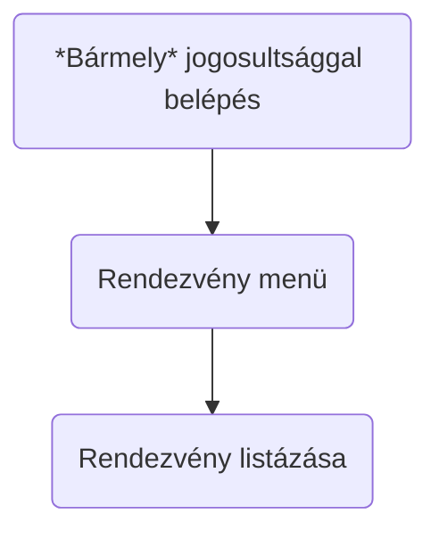
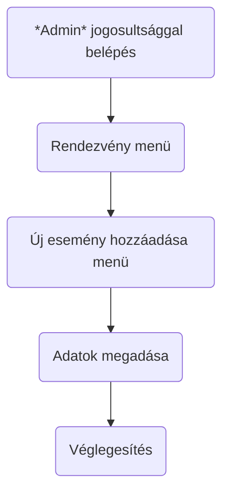
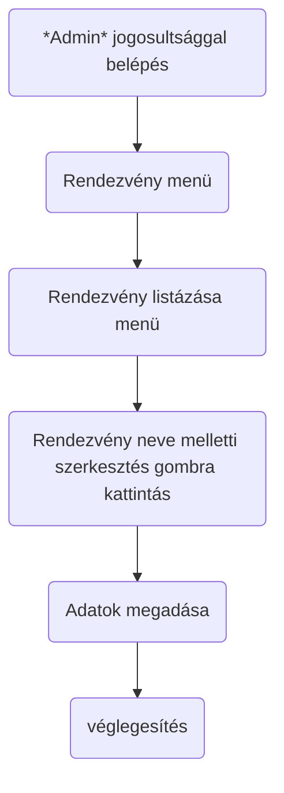
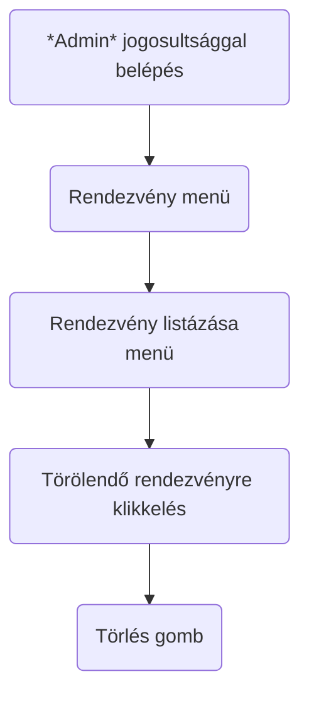
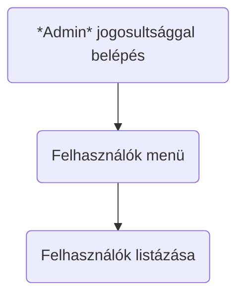
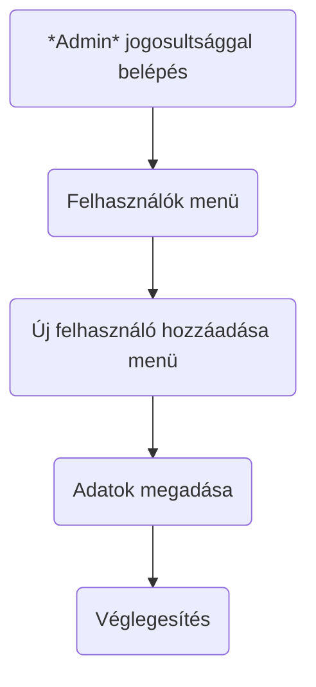
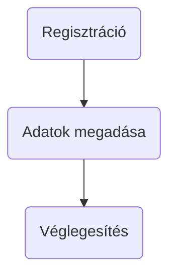
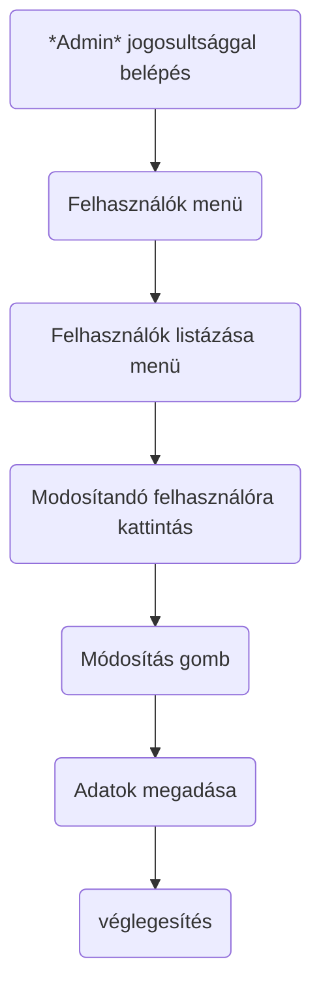
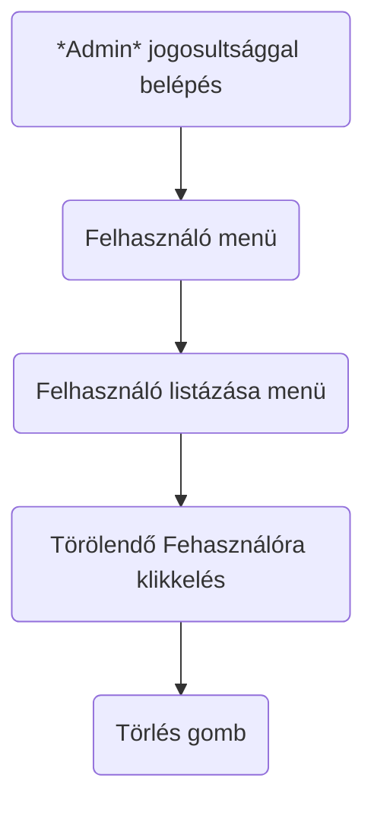

# Funckionális specifickáció

## 1. Jelenlegi helyzet leírása
A cégünket megbízó rendezvényszervezői vállalkozásban jelenleg használt jelentkezés módja elavult, és nem megbízható. Általában az egyes események saját oldalain történik a regisztráció, azonban a csapatunkat felkérő rendezvényszervezői vállalkozás számára ilyen formán problémás jelentkezők nyomon követése, valamint egyes statisztikák elkészítése. Így egy olyan weboldalt szeretne, ahol a felhasználók regisztrációt és bejelentkezést követően a különböző rendezvényekre maguknak foglalhatnak helyet, illetve lemondhatják a már foglalt helyeket. A megrendelő célja, hogy az általunk elkészített weboldalon a lehető legtöbb helyet foglalják le az ingyenes rendezvényekre.

## 2. Vágyálomrendszer leírása
A megrendelő olyan weboldalt vár el csapatunktól, mely felületen a felhasználói regisztráció után az eseményekre és a rendezvényekre való jelentkezés egy kattintással elérhető. Fontos, hogy a jelentkezés minden esetben regisztrációhoz kötött.
A weboldalon admin jogosultsággal rendelkezők statisztikákat készíthetnek különböző szociográfiai adatokra vonatkozóan, mint lakóhely, életkor, legmagasabb iskolai végzettség valamint foglalkozás. A weboldalon szükség van a jelentkezések módosításának és törlésének lehetőségére is.

## 3. Jelenlegi üzleti folyamatok modellje

A jelenlegi folyamat a következő:

1. A rendezvényszervező cég létrehoz egy eseményt, és közzéteszi a weboldalán.
2. A felhasználók az esemény oldalára látogatnak, és kitöltik a regisztrációs űrlapot.
3. A regisztrációs űrlap adatait manuálisan rögzítik a rendezvényszervezők.
4. A rendezvényszervezők e-mailben értesítik a regisztrált felhasználókat a részletekről.
5. A felhasználók a rendezvény napján megjelennek a helyszínen.

A folyamat problémái:

- A manuális regisztráció időigényes és hibalehetőségeket hordoz magában.
- Nehéz nyomon követni a jelentkezőket és statisztikákat készíteni.
- A regisztráció nem megbízható, a felhasználók bármikor lemondhatják a részvételt e-mailben.

## 4. Igényelt üzleti folyamatok modellje

A javasolt megoldás:

Egy új weboldal kifejlesztése, ahol a felhasználók regisztrációt és bejelentkezést követően a különböző rendezvényekre maguknak foglalhatnak helyet, illetve lemondhatják a már foglalt helyeket. A weboldal automatikusan rögzíti a regisztrációs adatokat, és statisztikákat készít a jelentkezőkről.

A javasolt megoldás előnyei:

- Hatékonyabb és megbízhatóbb regisztrációs folyamat.
- Könnyebb nyomon követni a jelentkezőket és statisztikákat készíteni.
- A felhasználók kényelmesebben foglalhatnak és mondhatnak le helyeket.

Online folyamatok user szintű egyének számára:
Amíg nem jelentkezik be a user vagy admin szintü felhasználó addig csak az alábbi menürendszer érhetőek el:

- Főmenü
- Regisztráció
- Be és kijelentkezés

User szintü felhasználó:
 
Helyfoglalás: 
- Bejelentkezés: bejelentkezés gomb => felhasználó név és jelszó megadása => Bejelentkezési oldal megjelenése. => Egy addott esemény részletek gombjára klikkelve megjelenik 1 gomb feliratkozás 
 
Rendezvényről való leiratkozás: 
- Bejelentkezés: bejelentkezés menü => felhasználó név és jelszó megadása => Bejelentkezési oldal megjelenése. => Egy addott esemény részletek gombjára klikkelve megjelenik leiratkozás gomb ha a felhasználó már feliratkozott.

Admin szintü felhasználó:
 
Új felhasználó hozzáadása: 
- Bejelentkezés: bejelentkezés gomb => felhasználó név és jelszó megadása => Bejelentkezési oldal megjelenése. => Felhasználók menü => Új felhasználó hozzáadása 
Felhasználó adatainak a módosítása: 
- Bejelentkezés: bejelentkezés gomb => felhasználó név és jelszó megadása => Bejelentkezési oldal megjelenése. => Felhasználók menü => Felhasználók listázása => A kiválasztott felhasználóra kattintva => módosítás 
Felhasználó törlése: 
- Bejelentkezés: bejelentkezés gomb => felhasználó név és jelszó megadása => Bejelentkezési oldal megjelenése. => Felhasználók menü => Felhasználók listázása => A kiválasztott felhasználóra kattintva => törlés 
Felhasználók listázása: 
- Bejelentkezés: bejelentkezés gomb => felhasználó név és jelszó megadása => Bejelentkezési oldal megjelenése. => Felhasználók menü => Felhasználó listázása 

Új rendezvény hozzáadása: 
- Bejelentkezés: bejelentkezés gomb => felhasználó név és jelszó megadása => Bejelentkezési oldal megjelenése. => Rendezvények menü => Új rendezvény hozzáadása 
Rendezvény adatainak a módosítása: 
- Bejelentkezés: bejelentkezés gomb => felhasználó név és jelszó megadása => Bejelentkezési oldal megjelenése. => Rendezvények listázása => R Módosítani kívánt rendezvény kiválasztása => rendezvény adatainak módosítása gomb => módosítása 
Rendezvény adatainak a törlése
- Bejelentkezés: bejelentkezés gomb => felhasználó név és jelszó megadása => Bejelentkezési oldal megjelenése. => Rendezvények listázása => R Módosítani kívánt rendezvény kiválasztása => rendezvény adatainak módosítása gomb => törlés 
Felhasználók listázása: 
- Bejelentkezés: bejelentkezés gomb => felhasználó név és jelszó megadása => Bejelentkezési oldal megjelenése. => Rendezvények menü => Rendezvény listázása 

Rendezvény listázása

Új rendezvény felvitele

Rendezvény adatainak módosítása

Rendezvény törlése

Felhasználó listázása

Új felhasználó hozzáadása

Új felhasználó hozzáadása user szint

Felhasználó adatainak módosítása

Felhasználó törlése

## 5. Követelménylista

| Id | Modul | Név | Leírás |
| :---: | --- | --- | --- |
| K01 |	V1.0 | User adminisztrációja | User regisztrálása, törlése az igényelt üzleti folyamatokban leírtak szerint. |
| K02 | V1.0 | Rendezvények adminisztrációja | Rendezvények létrehozása, törlése az igényelt üzleti folyamatokban leírtak szerint.
| K03 | V1.0 | Foglalás adminisztrációja | Foglalás folyamatának kezelése a szükséges üzleti folyamatokban leírtak szerint. |
| K04 | V1.0 | Felhasználói fiókok kezelése | Bejelentkezés, felhasználói adatok módosítása, meghívók rögzítése az adatbázisban, listák és kimutatások elkészítése a szükséges üzleti folyamatokban leírtak szerint. |        
| K05 | V1.0 | Egyszerűen használható kezelőfelület | A legelterjedtebb internet böngészőkből használható felület megvalósítása az admin számára. |
| K06 | V1.0 | Online elérhető nyilvános rendezvények listája | Online elérhető nyilvános rendezvények listája, de a résztvétel regisztrációhoz kötött. |
| K07 | V1.0 | Platformfüggetlen, robusztus működés | Szabványos, az iparágban folyamatosan bevált operációs rendszertől független technológiák használata: Php, React, Node js, MySQL. |
| K08 | V1.0 | Költséghatékony üzemeltetés | A szabványos és elterjedt technológiák használatát biztosítja. |
| K09 | V1.0 | Bővíthetőség | A kezelt adatok mennyiségének, valamint a felhasználók számának bővíthetősége és utólag újabb funkciók hozzáadásának lehetőségének biztosítása. |

## 6. Használati esetek
A rendszer használói a következők:

* felhasználó (meghívott vendég)
* adminisztrátor

A rendszernek a következő funkciókat kell ellátnia:

* az adminisztrátorok tudjanak eseményeket és rendezvényeket létrehozni és törölni
* az adminisztrátorok tudjanak meghívókat küldeni
* az adminisztrátorok tudjanak statisztikát készíteni a QR kódos leolvasás alapján
* az adminisztrátorok tudjanak meghívókat jóváhagyni
* a felhasználók belépés után meg tudják nézni az események és rendezvények részleteit

Előfeltételek:

* adminisztrátorok és felhasználók részére a rendszer használatához jogosultság, azaz jelszó szükséges
* felhasználóknak az alkalmazás használatához regisztráció szükséges

## 7. Megfeleltetés, hogyan fedik le a használati esetek a követelményeket
* K01, K02, K03: Az alkalmazást úgy hozzuk létre, hogy tartalmazza az események és rendezvények adminisztrációját, melyet az adminisztrátorok felhasználó név/jelszó megadásával a rendszerbe belépve fognak elérni. Ezek fogják adni az alkalmazás fő funkcióit.
* K04: Különböző jogosultsági szinteket fogunk kialakítani. Az adminisztrátori jogosultsággal rendelkezők minden funkcióhoz hozzá fognak férni, felhasználói (meghívott vendég) fiókokat tudnak létrehozni/törölni. Az adminisztrátorok jogosultságuk függvényében a felületre belépve listákat és kimutatásokat tudnak majd lekérni.
* K05: A felhasználói felületet úgy alakítjuk ki, hogy egy általános weboldal képét nyújtsa, továbbá, hogy az egyes funkciók egyértelmű elnevezésével könnyen elérhetőek és érthetőek lesznek.
* K06: A web alkalmazást úgy hozzuk létre, hogy az online felületen keresztül lehessen keresni a nyilvánosan elérhető események és rendezvények között az adatbázisban. A részvétel azonban kizárólag a rendszerbe való regisztráció után lehetséges.
* K07: A rendszer elkészítésekor ügyelünk a platformfüggetlen, robosztus működés kialakítására, ezért ellenőrizzük kódunk helyességét, hogy egy adott HTML elemet támogatják-e a böngészők, fontosabb alkalmazások és kisegítő technológiák. A HTML vizsgálatba beleértjük a CSS vizsgálatot is. A teszteléseket elvégezzük Firefox, Chrome, Explorer, Opera, Safari böngészőkön, ill. Windows, Linux, iOs operációs rendszereken is.
* K08: A szabványos és elterjedt technológiák használata biztosítja.
* K09: A kezelt adatokat MYSQL adatbázisban fogjuk tárolni. Az adatbázis használatával biztosítjuk az adatok bővíthetőségét. Az alkalmazást PHP objektum orientált módon valósítjuk meg, amellyel új funkciókat könnyedén tudunk utólag hozzáadni a rendszerhez.

## 8. Képernyőtervek
Login screen

Rendezvények nézet

Egy rendezvényről részletesen

Admin oldali statisztika

## 9. Forgatókönyvek

## 10. Funkció - követelmény megfeleltetése

| Id | Követelmény | Funkció |
| :---: | --- | --- |
| K4 | ... | ... |

## 11 Fogalomszótár
