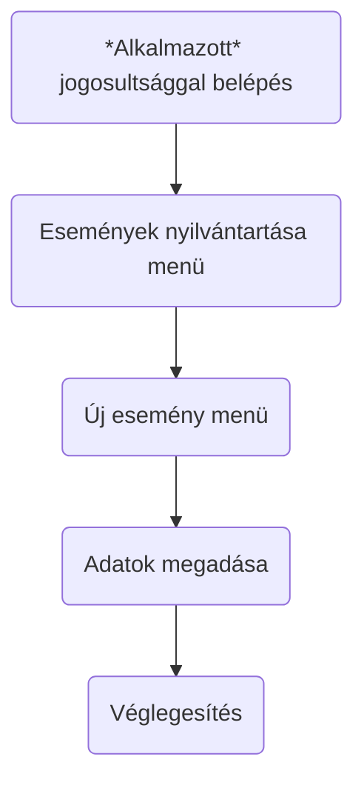
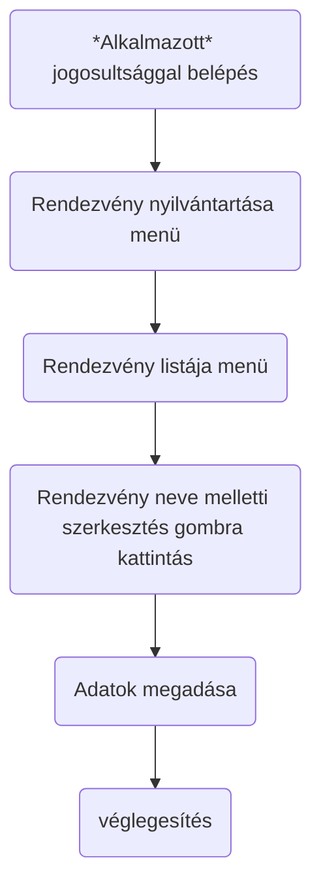
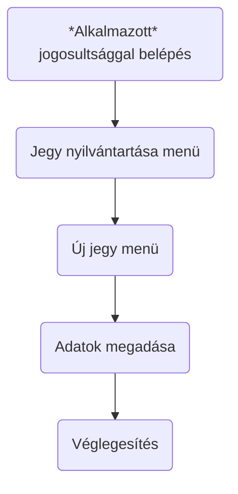
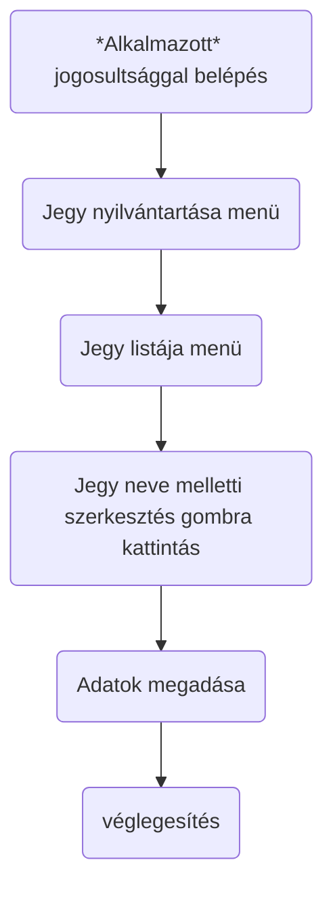

# Követelmény Specifikáció

## 1. Jelenlegi helyzet

A cégünket megbízó rendezvényszervezői vállalkozás azzal a feladattal bízta meg, hogy készítsünk számára egy olyan 
weboldalt, ahová regisztrálás, majd bejelentkezés után a felhasználó különböző rendezvényekre foglalhat magának helyet vagy ha már foglalt akkor le is tud róla iratkozni. A megrendelőnek ez egy teljesen új vállalkozása lenne és az lenne a célja, hogy az általunk elkészített weboldalon a lehető legtöbb helyet foglaljanak le. Ezek olyan rendezvények, amelyek mindenki számára ingyenes.

## 2. Vágyálomrendszer leírása 

A megrendelő olyan weboldat szeretne, ahol ott regisztrált rendezvényekre a felhasználói jogosultsággal rendelkező már bejelentkezett user egy kattintással tudjon magának helyet foglalni. Ehhez a felhasználónak előbb regisztrálnia kell magát. 
A weboldalon két típusú felhasználó lesz: 
    
- Admin
- User 

Admin szintü felhasználó jogai: 

- Új rendezvény hozzáadása
- Rendezvény adatainak a módosítása
- Rendezvény törlése
- Rendezvény listázása

- Új felhasználó hozzáadása (admin szintű és user szintű)
- Felhasználó adatainak a módosítása (admin szintű és user szintű)
- Felhasználó törlése (admin szintű és user szintű)
- Felhasználók listázása

User szintü felhasználó jogai: 

- Összes rendezvény listázása 
- Egy rendezvény adataina a megjelenítése
 
A tervezett menürendszer bejelentkezés előtt bármely szintü jogosultággal rendelkező felhasználónak:

- Főmenü
- Regisztráció
- Bejelentkezés

A tervezett menürendszer bejelentkezés után user jogosultággal rendelkező felhasználónak:

- Főmenü
- Rendezvények listászása
- Kijelentkezés
  
A tervezett menürendszer bejelentkezés után admin jogosultággal rendelkező felhasználónak:

- Főmenü
- Rendezvények listászása
- Rendezvények -> Rendezvény hozzáadása, Rendezvény módosítása,Rendezvény törlése,
- Felhasználók -> Új felhasználó hozzáadása, Felhasználó adatainak a módosítása, Felhasználó törlése
- Felhasználók listázása
- Kijelentkezés

## 3. Jelenlegi üzleti folyamatok modellje

A jelenlegi üzleti folyamatok nincsenek, hiszen a cégünket megbízó vállalkozás teljesen újonnan alakult. 

## 4. Igényelt üzleti folyamatok modellje
Üzleti folyamatok: 

Online folyamatok user szintű egyének számára:
Amíg nem jelentkezik be a user vagy admin szintü felhasználó addig csak az alábbi menürendszer érhetőek el:

- Főmenü
- Regisztráció
- Be és kijelentkezés

- Bejelentkezés: bejelentkezés menü => felhasználó név és jelszó megadása => Bejelentkezési oldal megjelenése. => Jegyvásárlás menüre klikkelve elérhető az az összes esemény és ott a jegyvásárlás gombra kattintva lehet megvásárolni a jegyet/bérletet.
- Kijelentkezés: bejelentkezés menü => Kijelentkezés gombra kattintás

Online folyamatok, a cégünket megbízó vállalkozás alkalmazottainak:
Ők lesznek az alkalmazott szintü felhasználó.
Az alkalmazottak minden menüpontot és funkciót elérhetnek, amit a vendégek kiegészítve az új rendezvény/esemény felvitele illetve módosítása illetve új jegytípus hozzáadása és módosítása. 
Alkalmazott szintü felhasználó regisztrálására csakis az admin szitű jogosultság szükséges.

Új rendezvény felvitele

Rendezvény adatainak módosítása

Új jegy felvitele

Jegy adatainak módosítása

test

