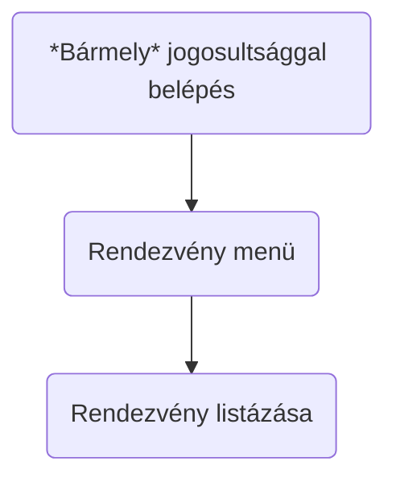
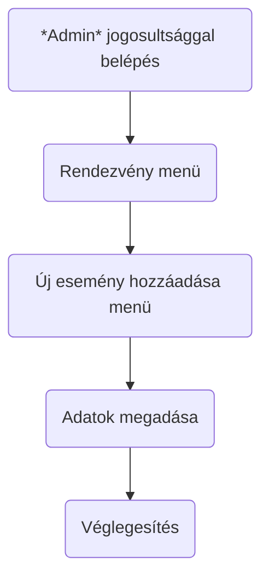
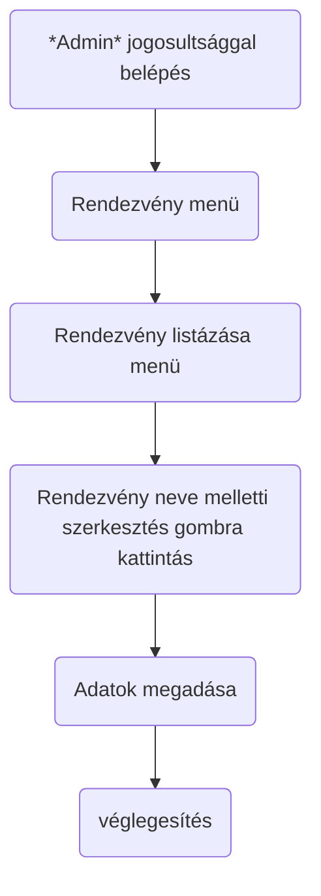
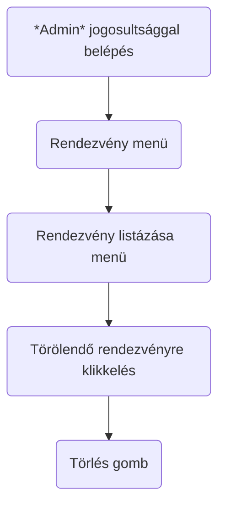
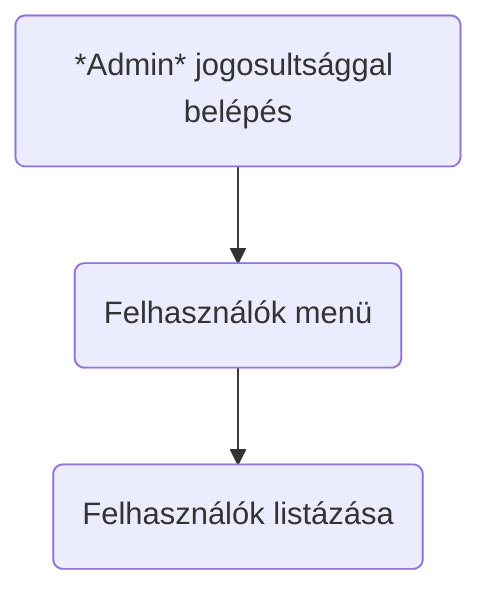
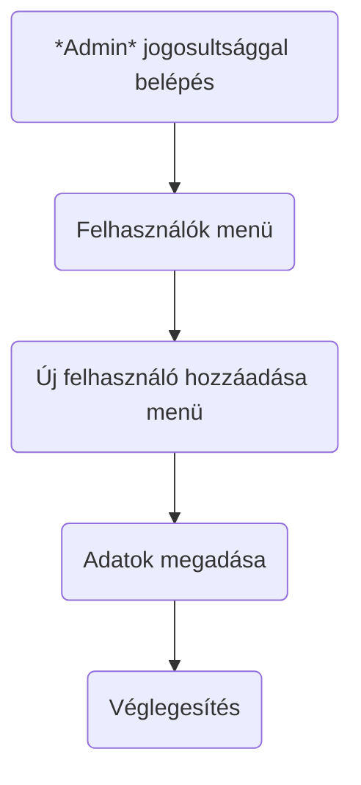
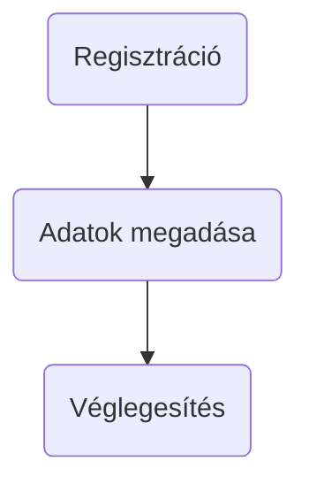
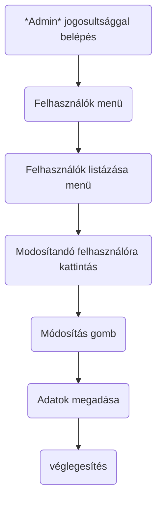
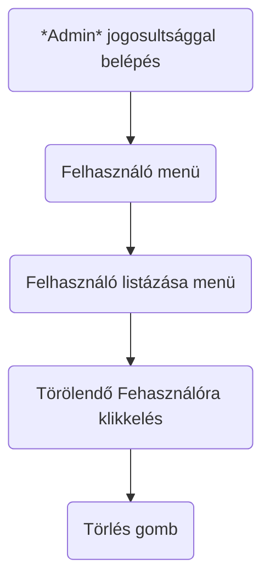

# Követelmény Specifikáció

## 1. Jelenlegi helyzet

A cégünket megbízó rendezvényszervezői vállalkozás azzal a feladattal bízta meg, hogy készítsünk számára egy olyan 
weboldalt, ahová regisztrálás, majd bejelentkezés után a felhasználó különböző rendezvényekre foglalhat magának helyet vagy ha már foglalt akkor le is tud róla iratkozni. A megrendelőnek ez egy teljesen új vállalkozása lenne és az lenne a célja, hogy az általunk elkészített weboldalon a lehető legtöbb helyet foglaljanak le. Ezek olyan rendezvények, amelyek mindenki számára ingyenes.

## 2. Vágyálomrendszer leírása 

A megrendelő olyan weboldat szeretne, ahol ott regisztrált rendezvényekre a felhasználói jogosultsággal rendelkező már bejelentkezett user egy kattintással tudjon magának helyet foglalni. Ehhez a felhasználónak előbb regisztrálnia kell magát. 
A weboldalon két típusú felhasználó lesz: 
    
- Admin
- User 

Admin szintü felhasználó jogai: 

- Új rendezvény hozzáadása
- Rendezvény adatainak a módosítása
- Rendezvény törlése
- Rendezvény listázása

- Új felhasználó hozzáadása (admin szintű és user szintű)
- Felhasználó adatainak a módosítása (admin szintű és user szintű)
- Felhasználó törlése (admin szintű és user szintű)
- Felhasználók listázása

User szintü felhasználó jogai: 

- Összes rendezvény listázása 
- Egy rendezvény adataina a megjelenítése
 
A tervezett menürendszer bejelentkezés előtt bármely szintü jogosultággal rendelkező felhasználónak:

- Főmenü
- Regisztráció
- Bejelentkezés

A tervezett menürendszer bejelentkezés után user jogosultággal rendelkező felhasználónak:

- Főmenü
- Rendezvények listászása
- Kijelentkezés
  
A tervezett menürendszer bejelentkezés után admin jogosultággal rendelkező felhasználónak:

- Főmenü
- Rendezvények listászása
- Rendezvények -> Rendezvény hozzáadása, Rendezvény módosítása,Rendezvény törlése,
- Felhasználók -> Új felhasználó hozzáadása, Felhasználó adatainak a módosítása, Felhasználó törlése
- Felhasználók listázása
- Kijelentkezés

## 3. Jelenlegi üzleti folyamatok modellje

A jelenlegi üzleti folyamatok nincsenek, hiszen a cégünket megbízó vállalkozás teljesen újonnan alakult. 

## 4. Igényelt üzleti folyamatok modellje
Üzleti folyamatok: 

Online folyamatok user szintű egyének számára:
Amíg nem jelentkezik be a user vagy admin szintü felhasználó addig csak az alábbi menürendszer érhetőek el:

- Főmenü
- Regisztráció
- Be és kijelentkezés

User szintü felhasználó:
 
Helyfoglalás: 
- Bejelentkezés: bejelentkezés gomb => felhasználó név és jelszó megadása => Bejelentkezési oldal megjelenése. => Egy addott esemény részletek gombjára klikkelve megjelenik 1 gomb feliratkozás 
 
Rendezvényről való leiratkozás: 
- Bejelentkezés: bejelentkezés menü => felhasználó név és jelszó megadása => Bejelentkezési oldal megjelenése. => Egy addott esemény részletek gombjára klikkelve megjelenik leiratkozás gomb ha a felhasználó már feliratkozott.

Admin szintü felhasználó:
 
Uj felhasználó hozzáadása: 
- Bejelentkezés: bejelentkezés gomb => felhasználó név és jelszó megadása => Bejelentkezési oldal megjelenése. => Felhasználók menü => Új felhasználó hozzáadása 
Felhasználó adatainak a módosítása: 
- Bejelentkezés: bejelentkezés gomb => felhasználó név és jelszó megadása => Bejelentkezési oldal megjelenése. => Felhasználók menü => Felhasználók listázása => A kiválasztott felhasználóra kattintva => módosítás 
Felhasználó törlése: 
- Bejelentkezés: bejelentkezés gomb => felhasználó név és jelszó megadása => Bejelentkezési oldal megjelenése. => Felhasználók menü => Felhasználók listázása => A kiválasztott felhasználóra kattintva => törlés 
Felhasználók listázása: 
- Bejelentkezés: bejelentkezés gomb => felhasználó név és jelszó megadása => Bejelentkezési oldal megjelenése. => Felhasználók menü => Felhasználó listázása 

Uj rendezvény hozzáadása: 
- Bejelentkezés: bejelentkezés gomb => felhasználó név és jelszó megadása => Bejelentkezési oldal megjelenése. => Rendezvények menü => Új rendezvény hozzáadása 
Rendezvény adatainak a módosítása: 
- Bejelentkezés: bejelentkezés gomb => felhasználó név és jelszó megadása => Bejelentkezési oldal megjelenése. => Rendezvények listázása => R Módosítani kívánt rendezvény kiválasztása => rendezvény adatainak módosítása gomb => módosítása 
Rendezvény adatainak a törlése
- Bejelentkezés: bejelentkezés gomb => felhasználó név és jelszó megadása => Bejelentkezési oldal megjelenése. => Rendezvények listázása => R Módosítani kívánt rendezvény kiválasztása => rendezvény adatainak módosítása gomb => törlés 
Felhasználók listázása: 
- Bejelentkezés: bejelentkezés gomb => felhasználó név és jelszó megadása => Bejelentkezési oldal megjelenése. => Rendezvények menü => Rendezvény listázása 

Rendezvény Listázása

Új rendezvény felvitele

Rendezvény adatainak módosítása

Rendezvény törlése

Felhasználó Listázása

Új felhasználó hozzáadása

Új felhasználó hozzáadása user szint

Felhasználó  adatainak módosítása

Felhasználó törlése

## 5 A rendszerre vonatkozó pályázat, törvények, rendeletek, szabványok és ajánlások felsorolása rész kidolgozása

Általános adatvédelmi rendelet (Általános adatvédelmi rendelet). Adatkezelési tájékoztató.

Szerzői jogi törvény ( http://www.sztnh.gov.hu/hu/szakmai-oldalak/jogforrasok-0 )

Polgári törvénykönyv ( http://uvegkep.hu/ptk.pdf )

Európai uniós rendeletek, irányelvek, ajánlások AZ EURÓPAI PARLAMENT ÉS A TANÁCS (EU) 2019/790 IRÁNYELVE (2019. április 17.) a digitális egységes piacon a szerzői és szomszédos jogokról, valamint a 96/9/EK és a 2001/29/ EK irányelv módosításáról

AZ EURÓPAI PARLAMENT ÉS A TANÁCS (EU) 2016/679 RENDELETE (2016. április 27.) a természetes személyeknek a személyes adatok kezelésével kapcsolatos védelméről és az ilyen adatok szabad áramlásáról,

A 2014/26/EU európai parlamenti és tanácsi irányelv a szerzői és szomszédos jogokra vonatkozó közös jogkezelésről és a zeneművek belső piacának online felhasználásának több területre kiterjedő hatályú engedélyezéséről szóló 2014. február 26-i A Bizottság 2012/417/EU (2012. július 17.) ajánlása a tudományos információkhoz való hozzáférésről és azok megőrzéséről

2012/417/EU (2012. július 17.) ajánlása a tudományos információkhoz való hozzáférésről és azok megőrzéséről;

AZ EURÓPAI PARLAMENT ÉS A TANÁCS 2016. április 27-i (EU) 2016/679 RENDELETE a természetes személyeknek a személyes adatok kezelése tekintetében történő védelméről és az ilyen adatok szabad áramlásáról, valamint a 95/46/EK irányelv hatályon kívül helyezéséről (általános adatvédelmi rendelet)

1992. évi LXIII. törvény a személyes adatok védelméről és a közérdekű adatok nyilvánosságáról

1999. évi LXXVI. törvény a szerzői jogról

2021. évi XXXVII. törvény a szerzői jogról szóló 1999. évi LXXVI. törvény és a szerzői jogok és a szerzői joghoz kapcsolódó jogok közös kezeléséről szóló 2016. évi XCIII. törvény jogharmonizációs célú módosításáról

A Bizottság 2011/711/EU ajánlása (2011. október 27.) a kulturális anyagok digitalizálásáról és online hozzáférhetőségéről, valamint a digitális megőrzésről

98/34/EK európai parlamenti és tanácsi irányelv a műszaki szabványok és szabályok, valamint az információs társadalom szolgáltatásaira vonatkozó szabályok információszolgáltatási eljárás megállapításáról (a 98/48/EK európai parlamenti és tanácsi irányelvvel módosított)

96/9/EK irányelv (1996. március 11.) az adatbázisok jogi védelméről

23/2011. (III. 8.) Korm. rendelet a zenés, táncos rendezvények működésének biztonságosabbá tételéről

## 6 Követelménylista 

| ID | Verzió | Név | Kifejtés |
| :---: | --- | --- | --- |
| K01 |	V1.0 | User adminisztrációja | User regisztrálása, törlése az igényelt üzleti folyamatokban leírtak szerint. |
| K02 | V1.0 | Rendezvények adminisztrációja | Rendezvények létrehozása, törlése az igényelt üzleti folyamatokban leírtak szerint.
| K03 | V1.0 | Foglalás adminisztrációja | Foglalás folyamatának kezelése a szükséges üzleti folyamatokban leírtak szerint. |
| K04 | V1.0 | Felhasználói fiókok kezelése | Bejelentkezés, felhasználói adatok módosítása, meghívók rögzítése az adatbázisban, listák és kimutatások elkészítése a szükséges üzleti folyamatokban leírtak szerint. |        
| K05 | V1.0 | Egyszerűen használható kezelőfelület | A legelterjedtebb internet böngészőkből használható felület megvalósítása az admin számára. |
| K06 | V1.0 | Online elérhető nyilvános rendezvények listája | Online elérhető nyilvános rendezvények listája, de a résztvétel regisztrációhoz kötött. |
| K07 | V1.0 | Platformfüggetlen, robusztus működés | Szabványos, az iparágban folyamatosan bevált operációs rendszertől független technológiák használata: Php, React, Node js, MySQL. |
| K08 | V1.0 | Költséghatékony üzemeltetés | A szabványos és elterjedt technológiák használatát biztosítja. |
| K09 | V1.0 | Bővíthetőség | A kezelt adatok mennyiségének, valamint a felhasználók számának bővíthetősége és utólag újabb funkciók hozzáadásának lehetőségének biztosítása. |

## 7 Fogalomtár

User:  rendezvényen résztvevő, aki előzetesn reisztrál, a regisztráció során megadja a különböző statisztikák leszűréséhez szükséges 
       adatokat

Admin: kezeli a User adatokat, javítja az estleges hibás regisztrációkat, kezeli a rendezvényekkel kapcsolatos válzozásokat, elvégzi az 
       új rendezvények létrehozását, leszűri a kívánt statisztikákat

Rendezvény: meghírdetett esemény, amelyen előzetes regisztrációval lehet részt venni

Statisztika: a regisztrált résztvevők által megadott adatokból, különböző lekérdezések által létrehozott kimutatások
