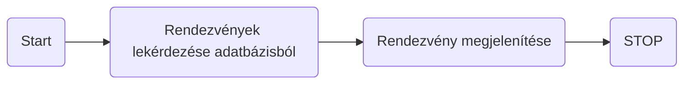
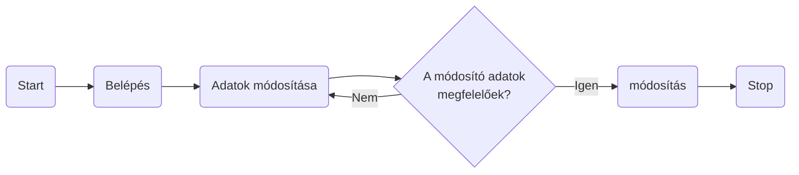
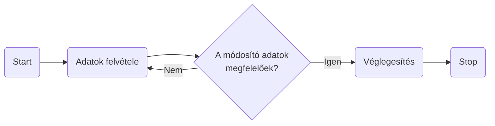
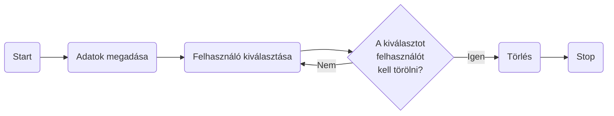
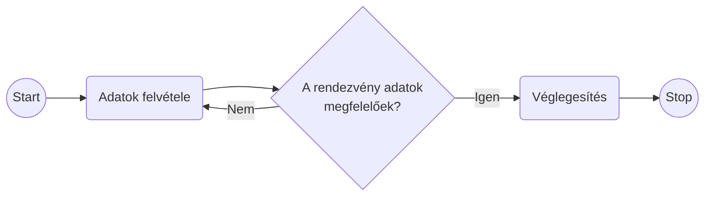
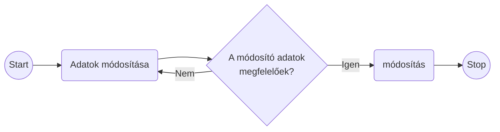
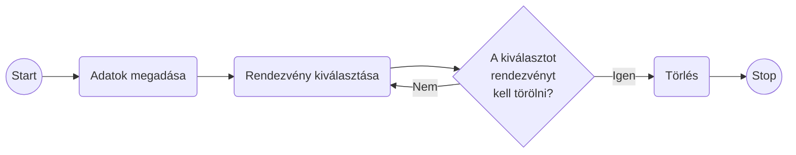
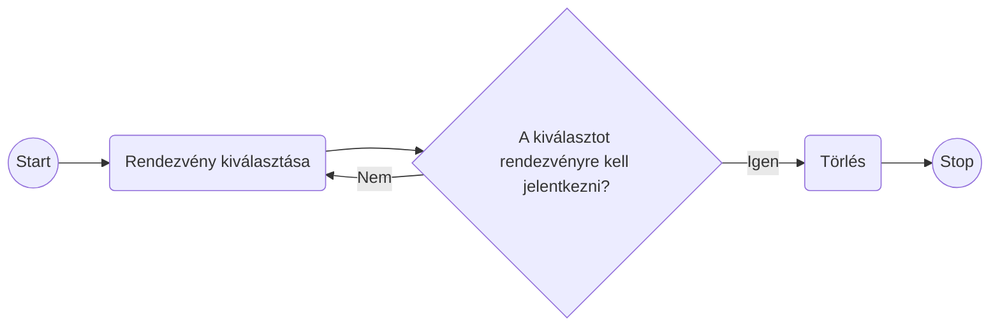
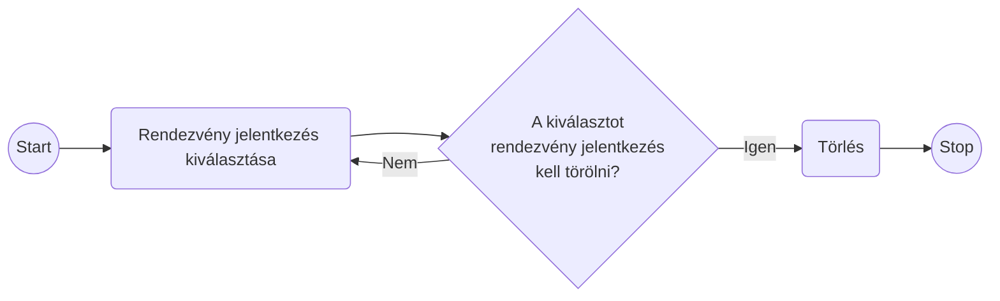

# Rendszerterv

## 1. Rendszer célja
A jegykezelő alkalmazás célja, hogy lehetővé tegye a rendezvényszervezői vállalkozásnak a rendezvények hatékony kezelését és a felhasználók számára egyszerű és gyors jegyfoglalást. Az alkalmazásnak az alábbi fő célokat kell teljesítenie:

### 1.1 Felhasználói regisztráció és bejelentkezés
A felhasználóknak lehetőséget kell biztosítani a regisztrációra és bejelentkezésre.
A bejelentkezett felhasználóknak különböző jogosultságokat kell biztosítani az alkalmazás használatához.

### 1.2 Rendezvények kezelése
A rendszer lehetővé kell tennie új rendezvények hozzáadását, meglévő rendezvények módosítását és törlését.
A rendezvényeket különböző tulajdonságokkal, például címmel, dátummal, helyszínnel és részletekkel kell rendelkezniük.

### 1.3 Jegyfoglalás
A felhasználóknak lehetőséget kell biztosítani a rendezvényekre való jegyfoglalásra.
A foglalásoknak tartalmazniuk kell a felhasználó nevét és a rendezvény adatait.

### 1.4 Felhasználók kezelése
Az adminisztrátoroknak lehetőséget kell biztosítani új felhasználók hozzáadására, meglévő felhasználók módosítására és törlésére.
A felhasználók adatait biztonságosan kell tárolni és kezelni.

### 1.5 Felhasználói felület
Az alkalmazásnak intuitív és felhasználóbarát felhasználói felülettel kell rendelkeznie.
A felhasználóknak könnyen hozzáférhető navigációs rendszerrel kell rendelkezniük a funkciókhoz és menükhöz.

## 2. Projektterv

### 2.1. Projektszerepkörök
* Scrum master: Lecza Tamás
* Product owner
* Üzleti szereplők
* Megrendelő

### 2.2 Projektmunkások és felelőségeik
* Frontend: (Feladatuk weboldal kinézetének az elkészítése, illetve a megrendelő által igényelt funkciók megvalósítása) Bakos Zsolt, Lecza Tamás
* Backend: (Feladatuk az adatbázis kialakítása illetve abból az adatok kiszolgálása a frontend számára) Andorfer katalin, Bezdán Anita, Kalmár János, Spengler András
* Tesztelés: Andorfer katalin, Bakos Zsolt, Bezdán Anita, Kalmár János, Lecza Tamás, Spengler András

### 2.3 Ütemterv

| Funkció | Feladat | Prioritás | Becslés (nap) | Aktuális becslés (nap) | Eltelt idő (nap) | Becsült idő (nap) |
| ------- | ------- | ----------| ------------- | ---------------------- | ---------------- | ----------------- |
| ....... | ....... | ......... | ............. | ...................... | ................ | ................. |

Követelmény specifikáció	
Funkcionális specifikáció
Rendszerterv
Adatmodell megtervezése	
Adatbázis megvalósítása a szerveren
Backend: Route & controllers elkészítése
Backend: Adatbázis kapcsolat megvalósítása	
Backend: Adatfeladolgozó funkciók megvalósítása
Website	Képernyőtervek elkészítése
Website	Prototípus elkészítése
Website	Adatbázis létrehozása
Website	Menüstruktúra elkészítése
Website	Kezdőlap funkciók elkészítése	
Website	Felhasználói felület elkészítése
Website	Alkalmazottak felület elkészítése
Website	Adminisztrátori felület elkészítése
Website	Tesztelés

### 2.4 Mérföldkövek
* A prototipus bemutatása
* Az elkészült szoftver átadása

## 3. Üzleti folyamatok modellje
### 3.1 Üzleti szereplők
A rendszert kizárólag regisztrálás után lehet használni. Ekkor a látogató a kezdőlapot tudja elérni, azon belül a keresés és részletes keresés menüpontokhoz van hozzáférése. Regisztrált üzleti szereplők tehát a felhasználók, és az adminisztrátorok.

### 3.2 Üzleti folyamatok
Bejelentkezés mindenki számára ugyanolyan lefutású: A ’Belépés’ menüpontra kattintva megjelenik a ’Felhasználó név’ és ’Jelszó’ beviteli űrlap. A mezők kitöltése után a ’Belépés’ gombra kattint a felhasználó. Ha az azonosítás sikeres, akkor a felhasználó belépett és megjelenik a jogosultságának megfelelő menüsor. Ha nem sikerül az azonosítás, hibaüzenet jelenik meg.

## 4. Követelmények

### 4.1 Funkcionális követelmények

| ID | Megnevezés | Leírás |
| --- | --- | --- |
| K1 | ... | ... |

#### 4.1.1 Felhasználói regisztráció és bejelentkezés
A felhasználóknak lehetőséget kell biztosítani regisztrációra a weboldalon.
A regisztrált felhasználók bejelentkezhetnek az alkalmazásba az e-mail címük és jelszavuk megadásával.

#### 4.1.2 Rendezvények böngészése és keresése
A felhasználóknak lehetőséget kell biztosítani a rendezvények böngészésére és keresésére különböző szempontok alapján, például dátum, helyszín vagy kategória szerint.

#### 4.1.3 Jegyfoglalás és vásárlás
A felhasználóknak lehetőséget kell biztosítani a jegyek foglalására és vásárlására a kiválasztott rendezvényekre.
A felhasználóknak meg kell adniuk a szükséges információkat (pl. név, kapcsolattartási adatok) a jegyfoglalás és vásárlás során.

#### 4.1.4 Felhasználói profilkezelés
A felhasználóknak lehetőséget kell biztosítani a profiljuk szerkesztésére és a beállítások módosítására.
A felhasználóknak lehetőségük kell legyen a korábbi foglalásaik és vásárlásaik megtekintésére a profiljukban.

#### 4.1.5 Rendezvények kezelése (admin felületen)
Az adminisztrátoroknak lehetőséget kell biztosítani új rendezvények hozzáadására, meglévő rendezvények szerkesztésére és törlésére.
Az adminisztrátoroknak lehetőségük kell legyen a jegyárak, rendelkezésre álló helyek és más rendezvény-adatok kezelésére.

### 4.2 Nem funkcionális követelmények

| ID | Megnevezés | Leírás |
| --- | --- | --- |
| K4 | ... | ... |

#### 4.2.1 Felhasználóbarát felhasználói felület
Az alkalmazásnak egyszerű és intuitív felhasználói felülettel kell rendelkeznie, amely könnyen kezelhető még kevésbé technikailag jártas felhasználók számára is.

#### 4.2.2 Teljesítmény
Az alkalmazásnak gyorsan kell válaszolnia a felhasználói interakciókra és meg kell felelnie a várt teljesítményi szinteknek még nagy forgalom esetén is.

#### 4.2.3 Biztonság
Az alkalmazásnak megfelelő biztonsági intézkedésekkel kell rendelkeznie az adatvédelem és az ügyféladatak védelme érdekében, például titkosított adatkapcsolatok, jelszóvédelem stb.

#### 4.2.4 Skálázhatóság
Az alkalmazásnak képesnek kell lennie a könnyű skálázódásra, hogy kezelni tudja a növekvő felhasználói forgalmat és a különböző események időszakos igényeit.

#### 4.2.5 Kompatibilitás
Az alkalmazásnak kompatibilisnek kell lennie a különböző böngészőkkel és eszközökkel, hogy a felhasználók széles körének nyújtson hozzáférést és élményt.

#### 4.2.6 Hibatűrés
Az alkalmazásnak képesnek kell lennie a hibák kezelésére és azok helyreállítására anélkül, hogy azok jelentősen befolyásolnák a felhasználói élményt.

### 4.3 Támogatott eszközök

## 5. Funkcionális terv

### 5.1 Rendszerszereplők

A rendszerünkben két rendszerszereplő csoportot különböztetünk meg. Az egyik a Rendezvényekre jelentkeznek felhasználók csoportja. A másik a rendezvényi adminisztrációt végző adminok csoportja. A felhasználók igénybe veszik a rendezvényi kezelő szolgáltatásait, míg adminok ezt nyilvántarták, rendezvényeket hoznak létre/szerkesztik és kiszolgálják a felhasználókat. Az adminok több jogosultsággal rendelkeznek mint a felhasználók. Az ő feladatuk még az felhasználók értesítése problémák esetén, pl. Rendezvény elmaradás. 

### 5.2 Rendszerhasználati esetek és lefutásaik

#### 5.2.1 Rendezvények listázása

#### 5.2.2 Feléhasználó saját adatainak módosítása

#### 5.2.3 Új felhasználó regisztrálása

#### 5.2.4 Felhasználó törlése

#### 5.2.5 Rendezvény hozzáadása

#### 5.2.6 Rendezvény módosítása

#### 5.2.7 Rendezvény törlése

#### 5.2.8 Rendezvényre jelentkezés

#### 5.2.9 Rendezvény jelentkezés törlése

### 5.3 Menühierarchiák

A menürendszert egy, a weboldal fejléce alatt található navigációs sávban építettük fel.

A rendszerbe való bejelentkezés előtt nincs megjelenített kezdőlap, csak bejelentkezés után érhető el az oldal

Felhasználként belépve a menüben található a "Rendezvények", "Saját rendezvények", "Profilom", Kijelentkezés.

Adminisztrátorként belépve a menüben található a "Rendezvények", "Profilok", "Statisztika", "Kijelentkezés"

### 5.4 Képernyőtervek

Főbb oldalak:

Felhasználó felület, amely a felhasználó bejelentkezése után jelenik meg.

Admin felület, amely az adminisztrátor belépése utén jelenik meg.

## 6. Fizikai környezet
Frontend felületet React, a backend felületet NodeJS biztosítja.

### 6.1 Vásárolt szoftverkomponensek és külső rendszerek
Nincsenek vásárolt szoftverkomponensek.

### 6.2 Hardver és hálózati topológia
Az alkalmazás webplatformra készül, bármilyen oprendszeren futtatható.
Internet böngészőn keresztül érhető el a felhasználó felület.
Szerverhez interneten keresztül lehet csatlakozni.

### 6.3 Fizikai alrendszerek
Webszerver: 80-as porton elérhető HTTP szolgáltatás
Mysql adatbázis szerver
Kliens gépek: a követelményeknek megfelelő internet böngésző futtatására alkalmas PC-k.

### 6.4 Fejlesztő eszközök
- Visual Studio Code
- Notepad++
- Git

### 6.5 Keretrendszer
React, NodeJS, Mysql

## 8. Architekturális terv

### 8.1 Webszerver

### 8.2 Adatbázis rendszer

### 8.3 A program elérése, kezelése

## 9. Adatbázis terv

A projekt adatbázisaként mysql fog szolgálni, amiben a következőképpen alakulnak a táblák:

user:
- id
- email
- password
- active
- connectDate
- admin

rendezveny:
- id
- name
- date
- description

foglalas:
- id
- userId
- rendezvenyId
- createdDate

meghivo:
- id
- meghivoUserId
- meghivottEmail
- createdDate
- jovahagyott

## 10. Implementációs terv

- Visual Studio kód
- MySQL Workbench
- React
- Node js

## 11. Tesztterv

A tesztelések célja a rendszer és komponensei funkcionalitásának teljes vizsgálata,
ellenőrzése a rendszer által megvalósított üzleti szolgáltatások verifikálása.
A teszteléseket a fejlesztői csapat minden tagja elvégzi.
Egy teszt eredményeit a tagok dokumentálják külön fájlokba.

### 11.1 Tesztesetek

| Teszteset | Elvárt eredmény | 
|-----------|-----------------| 
| ... | ... |

### 11.2 A tesztelési jegyzőkönyv kitöltésére egy sablon

**Tesztelő:** Vezetéknév Keresztnév

**Tesztelés dátuma:** Év.Hónap.Nap

Tesztszám | Rövid leírás | Várt eredmény | Eredmény | Megjegyzés
----------|--------------|---------------|----------|-----------
például. Teszt #01 | Regisztráció | A felhasználó az adatok megadásával sikeresen regisztrálni tud  | A felhasználó sikeresen regisztrált | Nem találtam problémát.
... | ... | ... | ... | ...

## 12. Telepítési terv

### 12.1 Fizikai telepítési terv

### 12.2 Szoftver telepítési terv

## 13. Karbantartási terv

Fontos ellenőrizni:
