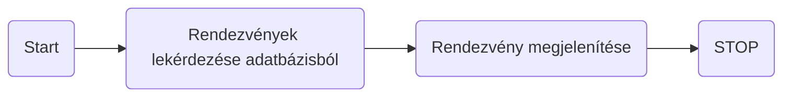
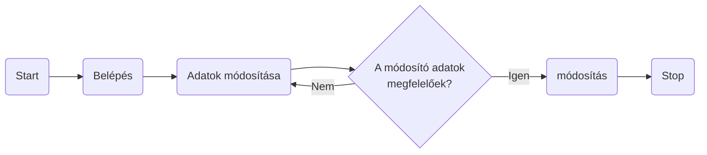
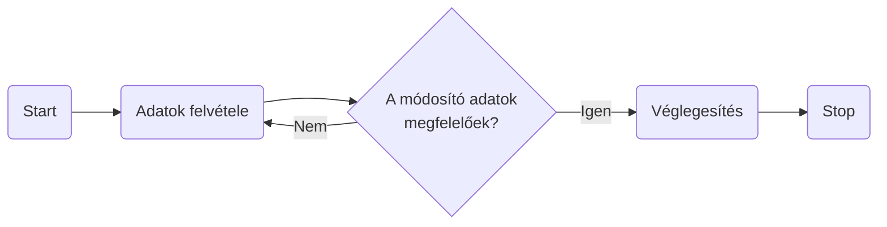
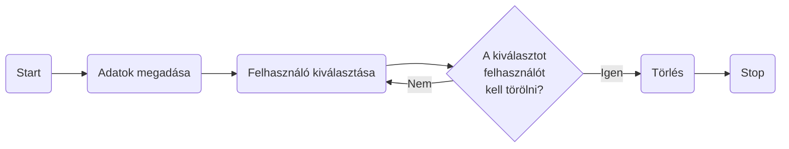
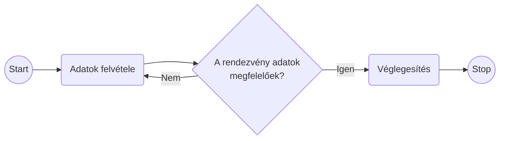
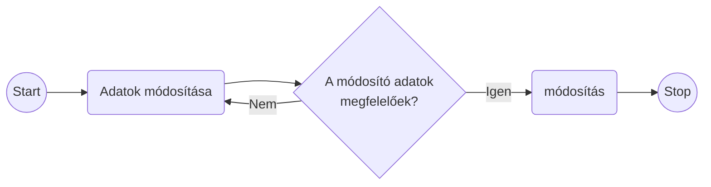
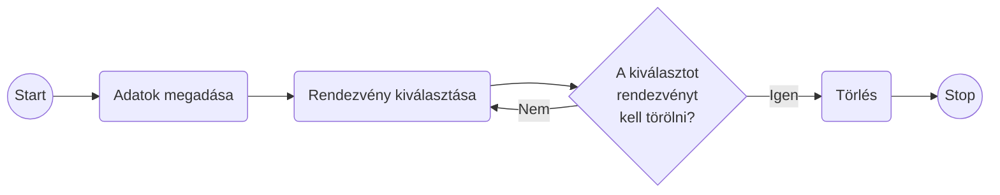
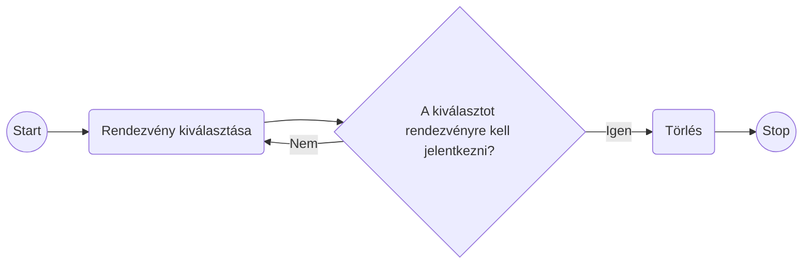
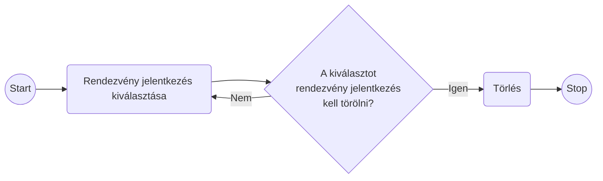

# Rendszerterv

## 1. Rendszer célja
A jegykezelő alkalmazás célja, hogy lehetővé tegye a rendezvényszervezői vállalkozásnak a rendezvények hatékony kezelését és a felhasználók számára egyszerű és gyors jegyfoglalást. Az alkalmazásnak az alábbi fő célokat kell teljesítenie:

### 1.1 Felhasználói regisztráció és bejelentkezés
A felhasználóknak lehetőséget kell biztosítani a regisztrációra és bejelentkezésre.
A bejelentkezett felhasználóknak különböző jogosultságokat kell biztosítani az alkalmazás használatához.

### 1.2 Rendezvények kezelése
A rendszer lehetővé kell tennie új rendezvények hozzáadását, meglévő rendezvények módosítását és törlését.
A rendezvényeket különböző tulajdonságokkal, például címmel, dátummal, helyszínnel és részletekkel kell rendelkezniük.

### 1.3 Jegyfoglalás
A felhasználóknak lehetőséget kell biztosítani a rendezvényekre való jegyfoglalásra.
A foglalásoknak tartalmazniuk kell a felhasználó nevét és a rendezvény adatait.

### 1.4 Felhasználók kezelése
Az adminisztrátoroknak lehetőséget kell biztosítani új felhasználók hozzáadására, meglévő felhasználók módosítására és törlésére.
A felhasználók adatait biztonságosan kell tárolni és kezelni.

### 1.5 Felhasználói felület
Az alkalmazásnak intuitív és felhasználóbarát felhasználói felülettel kell rendelkeznie.
A felhasználóknak könnyen hozzáférhető navigációs rendszerrel kell rendelkezniük a funkciókhoz és menükhöz.

## 2. Projektterv

### 2.1. Projektszerepkörök
* Scrum master: Lecza Tamás
* Product owner
* Üzleti szereplők
* Megrendelő

### 2.2 Projektmunkások és felelőségeik
* Frontend: (Feladatuk weboldal kinézetének az elkészítése, illetve a megrendelő által igényelt funkciók megvalósítása) Bakos Zsolt, Lecza Tamás
* Backend: (Feladatuk az adatbázis kialakítása illetve abból az adatok kiszolgálása a frontend számára) Andorfer katalin, Bezdán Anita, Kalmár János, Spengler András
* Tesztelés: Andorfer katalin, Bakos Zsolt, Bezdán Anita, Kalmár János, Lecza Tamás, Spengler András

### 2.3 Ütemterv

| Funkció | Feladat | Prioritás | Becslés (nap) | Aktuális becslés (nap) | Eltelt idő (nap) | Becsült idő (nap) |
| ------- | ------- | ----------| ------------- | ---------------------- | ---------------- | ----------------- |
| ....... | ....... | ......... | ............. | ...................... | ................ | ................. |

* Követelmény specifikáció	
* Funkcionális specifikáció
* Rendszerterv
* Adatmodell megtervezése	
* Adatbázis megvalósítása a szerveren
* Backend: Route & controllers elkészítése
* Backend: Adatbázis kapcsolat megvalósítása	
* Backend: Adatfeladolgozó funkciók megvalósítása
* Website	Képernyőtervek elkészítése
* Website	Prototípus elkészítése
* Website	Adatbázis létrehozása
* Website	Menüstruktúra elkészítése
* Website	Kezdőlap funkciók elkészítése	
* Website	Felhasználói felület elkészítése
* Website	Alkalmazottak felület elkészítése
* Website	Adminisztrátori felület elkészítése
* Website	Tesztelés

### 2.4 Mérföldkövek
* A prototipus bemutatása
* Az elkészült szoftver átadása

## 3. Üzleti folyamatok modellje
### 3.1 Üzleti szereplők
A rendszert kizárólag regisztrálás után lehet használni. Ekkor a látogató a kezdőlapot tudja elérni, azon belül a keresés és részletes keresés menüpontokhoz van hozzáférése. Regisztrált üzleti szereplők tehát a felhasználók, és az adminisztrátorok.

### 3.2 Üzleti folyamatok
Bejelentkezés mindenki számára ugyanolyan lefutású: A ’Belépés’ menüpontra kattintva megjelenik a ’Felhasználó név’ és ’Jelszó’ beviteli űrlap. A mezők kitöltése után a ’Belépés’ gombra kattint a felhasználó. Ha az azonosítás sikeres, akkor a felhasználó belépett és megjelenik a jogosultságának megfelelő menüsor. Ha nem sikerül az azonosítás, hibaüzenet jelenik meg.

Online folyamatok user szintű egyének számára:
Amíg nem jelentkezik be a user vagy admin szintü felhasználó addig csak az alábbi menürendszer érhetőek el:

- Főmenü
- Regisztráció
- Be és kijelentkezés

User szintü felhasználó:
 
Helyfoglalás: 
- Bejelentkezés: bejelentkezés gomb => felhasználó név és jelszó megadása => Bejelentkezési oldal megjelenése. => Egy addott esemény részletek gombjára klikkelve megjelenik 1 gomb feliratkozás 
 
Rendezvényről való leiratkozás: 
- Bejelentkezés: bejelentkezés menü => felhasználó név és jelszó megadása => Bejelentkezési oldal megjelenése. => Egy addott esemény részletek gombjára klikkelve megjelenik leiratkozás gomb ha a felhasználó már feliratkozott.

Admin szintü felhasználó:
 
Új felhasználó hozzáadása: 
- Bejelentkezés: bejelentkezés gomb => felhasználó név és jelszó megadása => Bejelentkezési oldal megjelenése. => Felhasználók menü => Új felhasználó hozzáadása 
Felhasználó adatainak a módosítása: 
- Bejelentkezés: bejelentkezés gomb => felhasználó név és jelszó megadása => Bejelentkezési oldal megjelenése. => Felhasználók menü => Felhasználók listázása => A kiválasztott felhasználóra kattintva => módosítás 
Felhasználó törlése: 
- Bejelentkezés: bejelentkezés gomb => felhasználó név és jelszó megadása => Bejelentkezési oldal megjelenése. => Felhasználók menü => Felhasználók listázása => A kiválasztott felhasználóra kattintva => törlés 
Felhasználók listázása: 
- Bejelentkezés: bejelentkezés gomb => felhasználó név és jelszó megadása => Bejelentkezési oldal megjelenése. => Felhasználók menü => Felhasználó listázása 

Uj rendezvény hozzáadása: 
- Bejelentkezés: bejelentkezés gomb => felhasználó név és jelszó megadása => Bejelentkezési oldal megjelenése. => Rendezvények menü => Új rendezvény hozzáadása 
Rendezvény adatainak a módosítása: 
- Bejelentkezés: bejelentkezés gomb => felhasználó név és jelszó megadása => Bejelentkezési oldal megjelenése. => Rendezvények listázása => R Módosítani kívánt rendezvény kiválasztása => rendezvény adatainak módosítása gomb => módosítása 
Rendezvény adatainak a törlése
- Bejelentkezés: bejelentkezés gomb => felhasználó név és jelszó megadása => Bejelentkezési oldal megjelenése. => Rendezvények listázása => R Módosítani kívánt rendezvény kiválasztása => rendezvény adatainak módosítása gomb => törlés 
Felhasználók listázása: 
- Bejelentkezés: bejelentkezés gomb => felhasználó név és jelszó megadása => Bejelentkezési oldal megjelenése. => Rendezvények menü => Rendezvény listázása 

## 4. Követelmények

### 4.1 Funkcionális követelmények

| ID | Megnevezés | Leírás |
| --- | --- | --- |
| K1 | ... | ... |

#### 4.1.1 Felhasználói regisztráció és bejelentkezés
A felhasználóknak lehetőséget kell biztosítani regisztrációra a weboldalon.
A regisztrált felhasználók bejelentkezhetnek az alkalmazásba az e-mail címük és jelszavuk megadásával.

#### 4.1.2 Rendezvények böngészése és keresése
A felhasználóknak lehetőséget kell biztosítani a rendezvények böngészésére és keresésére különböző szempontok alapján, például dátum, helyszín vagy kategória szerint.

#### 4.1.3 Jegyfoglalás és vásárlás
A felhasználóknak lehetőséget kell biztosítani a jegyek foglalására és vásárlására a kiválasztott rendezvényekre.
A felhasználóknak meg kell adniuk a szükséges információkat (pl. név, kapcsolattartási adatok) a jegyfoglalás és vásárlás során.

#### 4.1.4 Felhasználói profilkezelés
A felhasználóknak lehetőséget kell biztosítani a profiljuk szerkesztésére és a beállítások módosítására.
A felhasználóknak lehetőségük kell legyen a korábbi foglalásaik és vásárlásaik megtekintésére a profiljukban.

#### 4.1.5 Rendezvények kezelése (admin felületen)
Az adminisztrátoroknak lehetőséget kell biztosítani új rendezvények hozzáadására, meglévő rendezvények szerkesztésére és törlésére.
Az adminisztrátoroknak lehetőségük kell legyen a jegyárak, rendelkezésre álló helyek és más rendezvény-adatok kezelésére.

### 4.2 Nem funkcionális követelmények

| ID | Megnevezés | Leírás |
| --- | --- | --- |
| K4 | ... | ... |

#### 4.2.1 Felhasználóbarát felhasználói felület
Az alkalmazásnak egyszerű és intuitív felhasználói felülettel kell rendelkeznie, amely könnyen kezelhető még kevésbé technikailag jártas felhasználók számára is.

#### 4.2.2 Teljesítmény
Az alkalmazásnak gyorsan kell válaszolnia a felhasználói interakciókra és meg kell felelnie a várt teljesítményi szinteknek még nagy forgalom esetén is.

#### 4.2.3 Biztonság
Az alkalmazásnak megfelelő biztonsági intézkedésekkel kell rendelkeznie az adatvédelem és az ügyféladatak védelme érdekében, például titkosított adatkapcsolatok, jelszóvédelem stb.

#### 4.2.4 Skálázhatóság
Az alkalmazásnak képesnek kell lennie a könnyű skálázódásra, hogy kezelni tudja a növekvő felhasználói forgalmat és a különböző események időszakos igényeit.

#### 4.2.5 Kompatibilitás
Az alkalmazásnak kompatibilisnek kell lennie a különböző böngészőkkel és eszközökkel, hogy a felhasználók széles körének nyújtson hozzáférést és élményt.

#### 4.2.6 Hibatűrés
Az alkalmazásnak képesnek kell lennie a hibák kezelésére és azok helyreállítására anélkül, hogy azok jelentősen befolyásolnák a felhasználói élményt.

### 4.3 Támogatott eszközök

## 5. Funkcionális terv

### 5.1 Rendszerszereplők

A rendszerünkben két rendszerszereplő csoportot különböztetünk meg. Az egyik a Rendezvényekre jelentkeznek felhasználók csoportja. A másik a rendezvényi adminisztrációt végző adminok csoportja. A felhasználók igénybe veszik a rendezvényi kezelő szolgáltatásait, míg adminok ezt nyilvántarták, rendezvényeket hoznak létre/szerkesztik és kiszolgálják a felhasználókat. Az adminok több jogosultsággal rendelkeznek mint a felhasználók. Az ő feladatuk még az felhasználók értesítése problémák esetén, pl. Rendezvény elmaradás. 

### 5.2 Rendszerhasználati esetek és lefutásaik

#### 5.2.1 Rendezvények listázása

#### 5.2.2 Feléhasználó saját adatainak módosítása

#### 5.2.3 Új felhasználó regisztrálása

#### 5.2.4 Felhasználó törlése

#### 5.2.5 Rendezvény hozzáadása

#### 5.2.6 Rendezvény módosítása

#### 5.2.7 Rendezvény törlése

#### 5.2.8 Rendezvényre jelentkezés

#### 5.2.9 Rendezvény jelentkezés törlése

### 5.3 Menühierarchiák

A menürendszert egy, a weboldal fejléce alatt található navigációs sávban építettük fel.

A rendszerbe való bejelentkezés előtt nincs megjelenített kezdőlap, csak bejelentkezés után érhető el az oldal

Felhasználként belépve a menüben található a "Rendezvények", "Saját rendezvények", "Profilom", Kijelentkezés.

Adminisztrátorként belépve a menüben található a "Rendezvények", "Profilok", "Statisztika", "Kijelentkezés"

### 5.4 Képernyőtervek

Főbb oldalak:

Felhasználó felület, amely a felhasználó bejelentkezése után jelenik meg.

Admin felület, amely az adminisztrátor belépése utén jelenik meg.

## 6. Fizikai környezet
Frontend felületet React, a backend felületet NodeJS biztosítja.

### 6.1 Vásárolt szoftverkomponensek és külső rendszerek
Nincsenek vásárolt szoftverkomponensek.

### 6.2 Hardver és hálózati topológia
Az alkalmazás webplatformra készül, bármilyen oprendszeren futtatható.
Internet böngészőn keresztül érhető el a felhasználó felület.
Szerverhez interneten keresztül lehet csatlakozni.

### 6.3 Fizikai alrendszerek
Webszerver: 80-as porton elérhető HTTP szolgáltatás
Mysql adatbázis szerver
Kliens gépek: a követelményeknek megfelelő internet böngésző futtatására alkalmas PC-k.

### 6.4 Fejlesztő eszközök
- Visual Studio Code
- Notepad++
- Git

### 6.5 Keretrendszer
React, NodeJS, Mysql

## 8. Architekturális terv

### 8.1 Webszerver

### 8.2 Adatbázis rendszer

### 8.3 A program elérése, kezelése

## 9. Adatbázis terv

A projekt adatbázisaként mysql fog szolgálni, amiben a következőképpen alakulnak a táblák:

user:
- id
- fullname
- email
- password
- active
- connectDate
- cookie
- isCookieExpired
- userRole

rendezveny:
- id
- name
- adress
- date
- description

foglalas:
- id
- userId
- rendezvenyId
- createdDate

meghivo:
- id
- meghivoUserId
- meghivottEmail
- createdDate
- jovahagyott

## 10. Implementációs terv

A webes felület PHP, HTML, CSS, és JavaScript technológiák felhasználásával készül, a weboldal kinézetének kivitelezése valamint a megrendelő által igényelt funkciók megvalósítása a frontend (Bakos Zsolt, Lecza Tamás) feladata. Az adatbázis kialakítása illetve abból adatok szolgáltatása a frontend részére a backend feladata (Andorfer katalin, Bezdán Anita, Kalmár János, Spengler András), az adatok tárolására MySql adatbázis szervert használunk. A tesztelés kivitelezésében mind a fontend, mind a backend résztvesz.

- Visual Studio kód
- MySQL Workbench
- React
- Node js

## 11. Tesztterv

A tesztelések célja a rendszer és komponensei funkcionalitásának teljes vizsgálata,
ellenőrzése a rendszer által megvalósított üzleti szolgáltatások verifikálása.
A teszteléseket a fejlesztői csapat minden tagja elvégzi.
Egy teszt eredményeit a tagok dokumentálják külön fájlokba.

A tesztelés során olyan hardver konfiguráción lesz tesztelve a szoftver, amilyet későbbiekben a megrendelő is fog használni.
Az általa használt konfigurációt a cégünkkel tudatta.
A cégünk a rendszer tesztelése céljából az alábbi bögészökön kívánja tesztelni. 
- Google Chrome
-  Mozilla Firefox
-   Microsoft Edge
  
A minimum hardverkonfiguráció: Intel Celeron processzor, 4GB RAM, 128GB HDD, a képernyők felbontása: 
1280x1024, 1920x1080.  

A tesztelés során az üzleti folyamatokhoz tartozó különböző forgatókönyvek eredményét vizsgáljuk. 
Ha valamelyik teszt sikertelen, akkor azt a részt átdolgozzuk, majdan újból teszteljük. Ez a folyamat addig fog ismétlődni míg  
át nem megy a teszten.

A rendszer tesztelésére létrehozunk a mysql workbanch adatbázis kezelő segítségével egy admin szintű felhasználót, és azzal a felhasználóval 
teszteljük az admin funkcióit a renszerben.

### 11.1 Tesztelt üzleti folyamatok adminisztátor szintű felhasználó:  

**A) Belépés a rendszerbe:**  
A kezdőoldalról be tud lépni a rendszerbe, majdan belépés után megjelenik minden funkció, amit előzőleg rögzítettünk.   

**Tesztesetek:**  
1. Nem regisztrált felhasználónév-jelszó esetében az elvárt eredmény, hogy a rendszer hibaüzenetben jelzi, és meg is jeleníti ezt a felhasználó számára.
2. Regisztrált felhasználónév-jelszó esetében az elvárt eredmény, hogy a rendszer belépteti az admin joggal rendelkező felhasználót, és navigációs sáv megváltozik.  

**B) Új rendezvény regisztrálása:**  
A teszteléshez az új rendezvények hozzáadása menüpontra kell kattintani, majd megjelenik az admin számára az űrlap különböző rublikákkal. 

||Űrlap mező|Követelmények||
|-|---------|-------------|-|
||Name|1. Kötelező 2. Nem lehet egy már regisztrált rendezvény név 3. Minimum 5 karakter hosszú legyen, betűk és számok szerepelhetnek benne ||
||Date|1. Kötelező 2. Pontosan 10 karakter hosszú, nem lehet a rendszeridő előtti időre, és aznapra beállítani||
||Description|1. Kötelező 2. Nem talmazhat számjegyet, nagybetűvel kezdődik, ||

További követelmény, hogy két azonos rendezvényt nem lehet felvinni, így a rendezvény név az egyedinek kell lennie, és a description rész biztonsági okokból szűrve sql injection típusú támadás ellen.

**Tesztesetek:**  
1. Bevitt adatok helyesek, megfelelnek a követelményeknek.  
Elvárt eredmény:  
a) A felvitt rendezvény megjelenik a rendezvények listázási gombra kattintva.  
 
2. Bevitt adatok között szerepelnek a fenti követelményeknek nem megfelelő adatok.  
Elvárt eredmény: a rendszer hibaüzenetben jelzi a felhasználó számára a hibákat és a rendezvények listázása menüpontra kattintva nem jelenik meg a hibás adatokkal felvitt rendezvény. 
Ellenőrzés az 1. pont szerint.   

**C) Rendezvény adatainak módosítása:**  

Adatok módosítása úgy lehetséges, hogy a rendezvények listázása menüpontra kattintva megjeniki az összes már eddig felvitt rekord. A rekordal egysorba az 
adatok módosításra kell kattintania. Ezután megjelenik számára az adott rekord összes adata. Ezután van lehetőség az adatok módosításra.

||Űrlap mező||
|-|---------|-|
||Name||
||Date||
||Description||  

**Tesztesetek:**  
1. Adatmódosítás helyes adatokkal. Elvárt eredmény: a megfelelő rekord módosul a Rendezvény táblában.
Az adatok módosítása űrlap újbóli megjelenítésével ellenőrizhető a módosítás. A rendezvény aminek az adatai módosítva lettek, annak a rendezvények listázása után megjelenik a rendezvény a módosított adatokkal.  
2. Adatmódosítás követelményeknek nem megfelelő adatokkal: A rendezvény adatai nem frissülnek. Ha még eszer ráklikkenek a rendezvények listázás menüpontra ott nem frissül a rekord. Ellenőrzés az 1. pont szerint.

**D) Rendezvény törlése:**  

Egy már meglévő regisztrált rendezvény töléséhez rá kell klikkelni a rendzvények listázása menüre.

**Tesztesetek:**  
1. A rendezvények listázása után minden rekordhoz tartozik egy törlés gomb. A törlés gombra kattintva az oldal frissül, és a törölt rekord már nem jelenik meg.
2. A rendezvények listázása után minden rekordhoz tartozik egy törlés gomb. A törlés gombra kattintva az oldal frissül, és a törölt rekord megjelenik jelenik. Ekkor vissza kell küldeni ezt a funckiót a fejlesztőhöz.
Ellenőrzés: Rendezvény listázássa.

**E) Új admin és user jogkörrel rendelkező user regisztrálása:**  
A teszteléshez az új tag hozzáadása menüpontra kell kattintani, majd megjelenik az admin számára az űrlap különböző rublikákkal. 

||Űrlap mező|Követelmények||
|-|---------|-------------|-|
||Name|1. Kötelező 2. Lehet 2 ugyan olyan névvel rendelkező név 3. Minimum 5 karakter hosszú legyen, betűk és számok szerepelhetnek benne kötelező megadni ||
||Email|1. Kötelező 2. Min 5 karakter hosszú 3.Kötelező a @ jel és a pont karakerk||
||Password|1. Kötelező 2. legalább egy speciális karaktert kell hogy tartalmazzon. ||
||Connect date| 1. Automatikusan a rendszeridőt állítja be a rendszer  ||
||Admin|1. Kötelező 2. Pontosan 1 karakter hosszú. ||

További követelmény, hogy két azonos fehasználót nem lehet felvinni, így a felhasználó e-mail címének egyedinek kell lennie. Minden egyes mező biztonsági okokból szűrve van sql injection típusú támadás ellen.
Kötelező megadni a jogosultsági szintet. Egy fehasználóról egyértelműen el lehet majd dönteni a jogosultsági szintjét.

**Tesztesetek:**  
1. Bevitt adatok helyesek, megfelelnek a követelményeknek.  
Elvárt eredmény:  
a) A felvitt user megjelenik a userek listázási gombra kattintva.  
 
2. Bevitt adatok között szerepelnek a fenti követelményeknek nem megfelelő adatok.  
Elvárt eredmény: a rendszer hibaüzenetben jelzi a felhasználó számára a hibákat és a userek listázása menüpontra kattintva nem jelenik meg a hibás adatokkal felvitt user. 
Ellenőrzés az 1. pont szerint.   

**F) Felhasználó adatainak módosítása:**  

Adatok módosítása úgy lehetséges, hogy a felhasználók listázása menüpontra kattintva megjelenik az összes már eddig felvitt rekord. A rekordal egysorba az 
adatok módosításra kell kattintania. Ezután megjelenik számára az adott rekord összes adata. Ezután van lehetősés az adatok módosításra. A connect date mezőt nem lehet majd módosítani.
 
||Űrlap mező||
|-|---------|-|
||Name||
||Email||
||Password||
||Admin||

**Tesztesetek:**  
1. Adatmódosítás helyes adatokkal. Elvárt eredmény: a megfelelő rekord módosul a user táblában.
Az adatok módosítása űrlap újbóli megjelenítésével ellenőrizhető a módosítás. Annak a felhasználónak akinek az adatai módosítva lettek, annak a felhasználók listázása után megjelenik a módosított adatok.  
2. Adatmódosítás követelményeknek nem megfelelő adatokkal: A felhasználó adatai nem frissülnek. Ha még eszer ráklikkenek a felhasználók listázás menüpontra ott nem frissül a rekord. Ellenőrzés az 1. pont szerint.

**G) Felhasználó törlése:**  

Egy már meglévő regisztrált felhasználó töléséhez rá kell klikkelni a felhasználók listázása menüre.

**Tesztesetek:**  
1. A felhasználók listázása után minden rekordhoz tartozik egy törlés gomb. A törlés gombra kattintva az oldal frissül, és a törölt rekord már nem jelenik meg.
2. A felhasználók listázása után minden rekordhoz tartozik egy törlés gomb. A törlés gombra kattintva az oldal frissül, és a törölt rekord megjelenik jelenik. Ekkor vissza kell küldeni ezt a funckiót a fejlesztőhöz.
Ellenőrzés: Rendezvény listázássa.

### 11.2 A tesztelési jegyzőkönyv kitöltésére egy sablon

**Tesztelő:** Vezetéknév Keresztnév

**Tesztelés dátuma:** Év.Hónap.Nap

Tesztszám | Rövid leírás | Várt eredmény | Eredmény | Megjegyzés
----------|--------------|---------------|----------|-----------
például. Teszt #01 | Regisztráció | A felhasználó az adatok megadásával sikeresen regisztrálni tud  | A felhasználó sikeresen regisztrált | Nem találtam problémát.
... | ... | ... | ... | ...

## 12. Telepítési terv

#### Fizikai telepítési terv 
Szükség van egy adatbázis szerverre, amely közvetlenül csatlakozik a webszerververhez. -A webszerverre közvetlenül az internetről kapcsolódnak rá a kliensek.

#### Szoftver telepítési terv 
A szoftver webes felületéhez csak egy ajánlott a böngésző telepítése szükséges ( Google Chrome, Firefox, Opera, Edge) külön szoftver nem kell hozzá.

## 13. Karbantartási terv

* Rendszeres frissítések
Az alkalmazás kódjának és függőségeinek rendszeres frissítése, hogy biztosítsuk a biztonságot és a kompatibilitást az új böngészőkkel és eszközökkel.
* Adatbázis karbantartás
Rendszeres adatbázis mentések és karbantartások végrehajtása annak érdekében, hogy az adatok integritása és rendelkezésre állása megőrizhető legyen.
* Teljesítményoptimalizálás
   * Időnkénti teljesítményvizsgálatok végrehajtása az alkalmazás sebességének optimalizálása érdekében.
   * Gondoskodás arról, hogy az adatbázis lekérések és más szerveroldali műveletek hatékonyak és gyorsak legyenek.
* Felhasználói visszajelzések figyelembevétele
Rendszeres időközönként felülvizsgálni a felhasználók által beküldött visszajelzéseket, és prioritást adni a jelentős hibajelentéseknek és funkciók kéréseknek.
* Hibajavítás
   * Azonnali reakció a felhasználók által jelentett hibákra, és azok gyors kijavítása.
   * A hibajavítási folyamat során prioritást kell adni a működési hibáknak és a felhasználói élményt érintő problémáknak.
* Dizájnfrissítések
    * Időről időre frissíteni és felülvizsgálni az alkalmazás kinézetét és dizájnját annak érdekében, hogy modern és vonzó maradjon a felhasználók számára.
* Rendszermonitorozás és hibakeresés
   * Folyamatos rendszermonitorozás végrehajtása annak érdekében, hogy azonnal észleljük a rendszerhibákat vagy teljesítményproblémákat.
   * Rendszeres hibakeresés és naplózási fájlok elemzése az esetleges problémák azonosítása és azok orvoslása érdekében.
* Kompatibilitásellenőrzések
   * Rendszeres kompatibilitási tesztek végrehajtása különböző böngészőkben és eszközökön annak biztosítása érdekében, hogy az alkalmazás megfelelően működjön minden platformon.
* Rendszerarchitektúra felülvizsgálata
Időnkénti rendszerarchitektúra felülvizsgálata annak érdekében, hogy az alkalmazás könnyen karbantartható és kibővíthető maradjon.
* Felhasználói dokumentáció frissítése
   * Biztosítani a felhasználók számára naprakész dokumentációt az alkalmazás használatáról és funkcióiról, beleértve a frissítéseket és új funkciókat is.
